# Planetary Bridge for GRASS GIS

[](https://doi.org/10.5281/zenodo.20588644)

**Status:** v1.0.0 — 55 modules, 7 C libraries + 2 Python libraries, 30+ testsuite tests passing,
public-domain (Unlicense).

This project brings planetary-science image processing — historically the
domain of USGS [ISIS3](https://isis.astrogeology.usgs.gov/) — into the
GRASS GIS workflow. It also provides a complete landing-site evaluation
pipeline covering terrain, illumination, visibility, and multi-criteria
decision support. Each addon module is a self-contained GRASS binary or
Python script that reads/writes ordinary GRASS rasters and vectors.

## GRASS wxGUI integration

After installation the **Planetary** menu appears in the wxPython GUI between
the *Temporal* and *Help* menus. Every submenu is driven by the module's
keyword declarations — no hand-written menu file is needed for new modules.

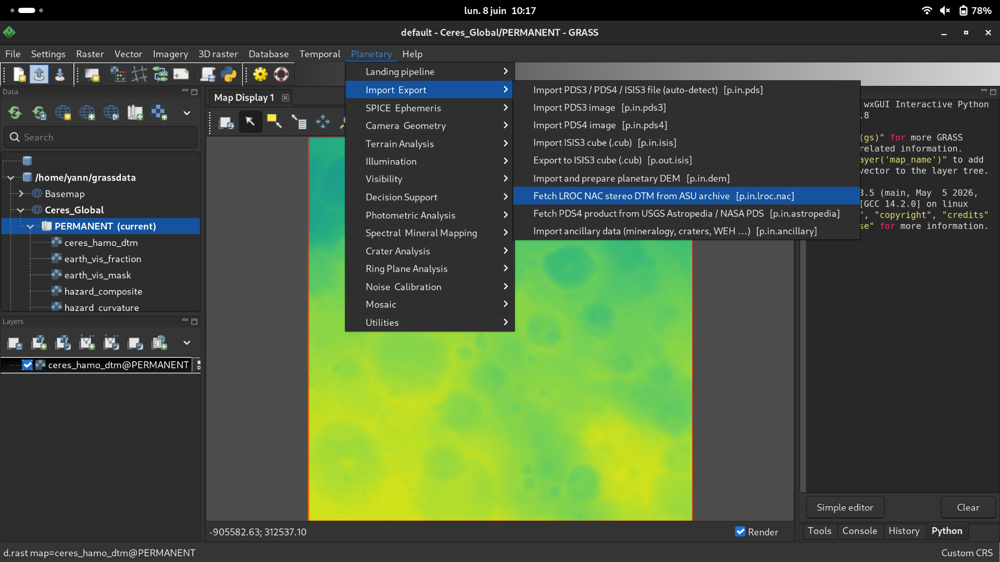

*Planetary top-level menu open on a Ceres Global mapset, with the
Import & Export submenu expanded showing the full set of PDS / ISIS / DEM
import commands.*

---

## Processing examples

### Pipeline overview

The body-agnostic pipeline takes a DEM, a body descriptor (radius, gravity,
axial tilt, rotation rate) and a mission descriptor (slope/roughness thresholds,
criterion weights, mission window, orbiter geometry, science targets) and
produces a normalised suitability surface, ranked candidate clusters and a
Monte-Carlo weight-perturbation report — without any body-specific code path.

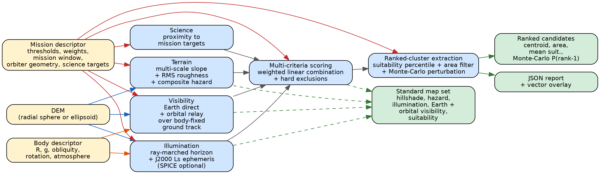

*Yellow blocks: per-analysis inputs (DEM, body descriptor, mission descriptor).
Blue blocks: body-invariant pipeline stages — terrain hazard, illumination,
visibility, science, multi-criteria scoring with hard exclusions, and
ranked-cluster extraction with Monte-Carlo weight perturbation.
Green blocks: canonical outputs (standard map set, ranked-candidate vector,
JSON report). Edge colours follow the data source: blue for DEM-derived flow,
orange for body-descriptor parameters, red for mission-descriptor parameters.*

---

### Terrain analysis — Luna-27 south-polar sector (Moon, LOLA 30 m)

LOLA 30 m topography of the Luna-27 study sector (~79–83°S, 1°W–51°E),
colour-coded elevation over hillshade. The sector spans 10.8 km of relief
(−4225 to +6576 m) and is dominated by overlapping impact craters and
inter-crater massifs characteristic of the rugged south-polar highlands.

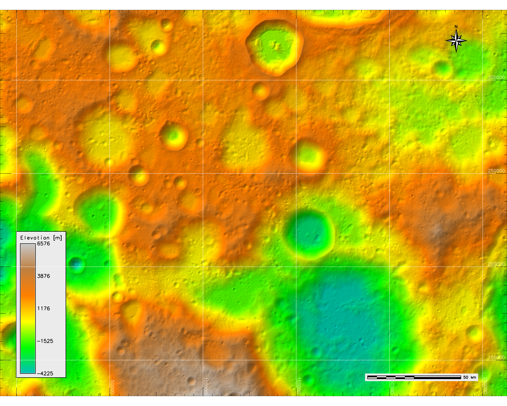

Slope at 30 m (left) averages 11.0° (σ = 6.8°) and reaches 82° on crater
walls; trafficable ground is confined to crater floors and inter-crater plains.
RMS surface roughness (right) averages 2.7 m but falls below 0.5 m on the
smoothest surfaces from which safe sites are drawn.

| Slope (°) over hillshade | RMS roughness (m) |
|:---:|:---:|
| 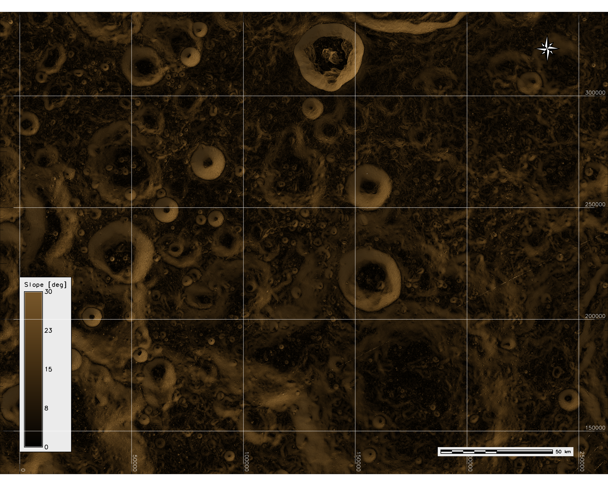 | 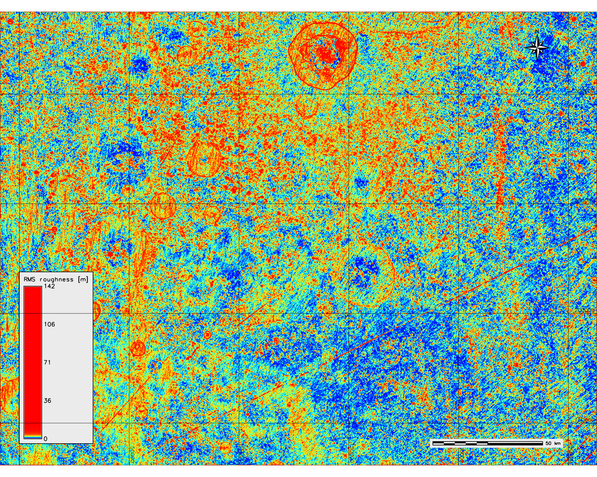 |

---

### Illumination & Earth visibility — Luna-27 sector (18.6-year nodal cycle)

Integrated over the full 18.6-year nodal cycle, the illuminated fraction
(left) averages 0.51, reaching unity on topographic highs
(near-persistently illuminated ridges) while crater interiors fall to zero
(permanently shadowed cold traps). Direct-to-Earth visible fraction (right)
averages 0.42 and peaks at 0.73; the Earth sits low towards the northern
horizon, so equator-facing slopes retain line of sight while poleward-facing
slopes and crater interiors are screened. The two fields are spatially
distinct — sites that are simultaneously well-lit and Earth-visible form a
genuine subset.

| Illuminated fraction | Earth-visible fraction |
|:---:|:---:|
| 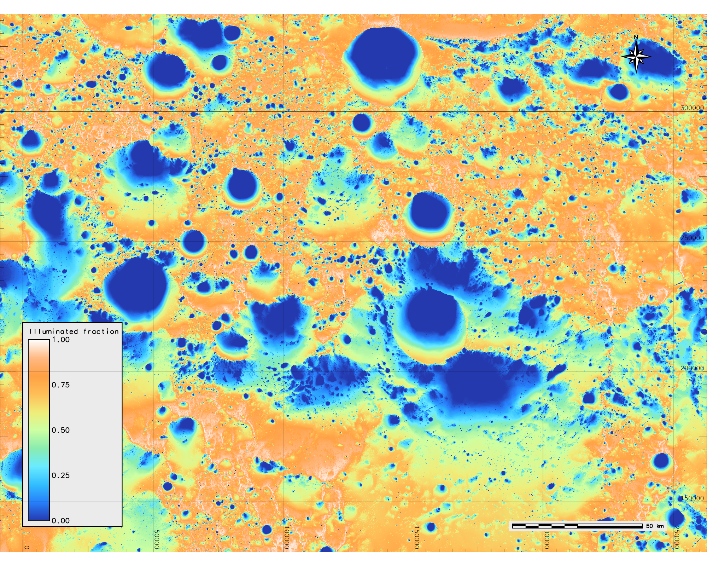 | 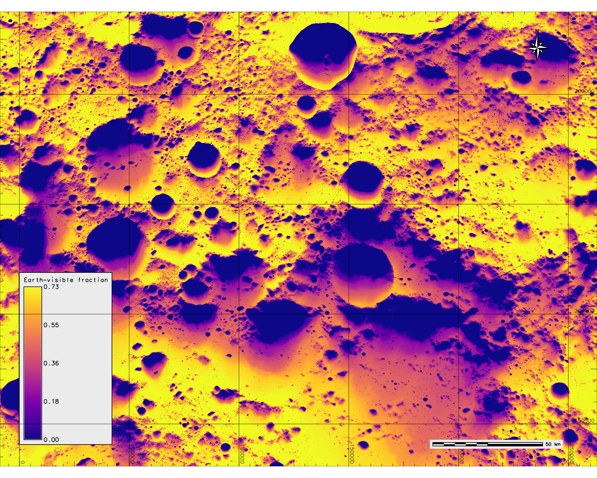 |

---

### Suitability surface and ranked candidates — Luna-27 sector

Weighted linear combination suitability surface over the full 271×207 km
sector. The hard-exclusion mask — driven mainly by metre-scale roughness —
removes 97.6% of pixels; the surviving 2.4% yields ten candidate clusters
(mean suitabilities 0.83–0.90) scattered across inter-crater terrain between
76° and 79°S. Monte-Carlo weight perturbation (1000 realisations) concentrates
rank-1 probability on two patches (P = 0.52 and 0.48), exposing genuine
ambiguity at this DEM resolution.

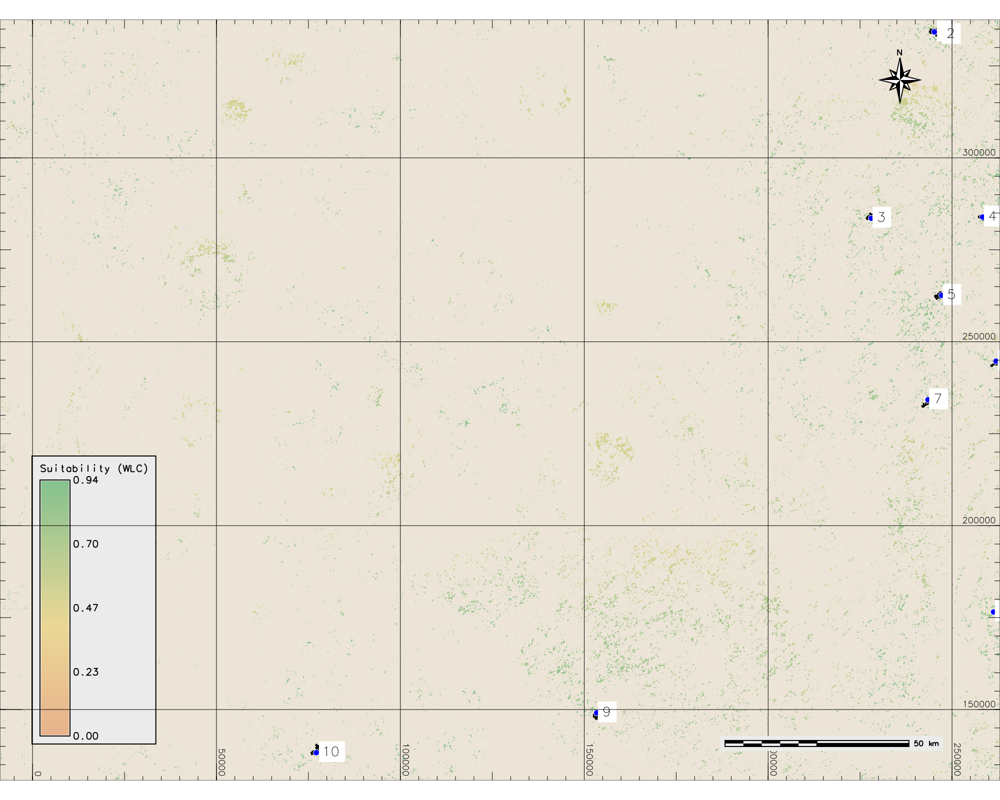

---

### Cross-validation: Mars 2020 Perseverance landing recovered (HiRISE 2 m)

Pipeline run on the touchdown-bounding HiRISE controlled stereo DTM
(`DTEEC_045994_1985_046060_1985_U01`, 2 m posting, 25.1 M cells) using
criteria taken from the published Mars 2020/MSL envelope and Jezero-specific
targets — weights were not tuned to the outcome. Seven candidate clusters
emerge above the 70th-percentile suitability threshold; the Octavia E. Butler
Landing point (★) falls inside candidate #1, the deterministically optimal
0.29 km² cluster. The Monte-Carlo-favoured candidate #2 (5.62 km²,
P(rank-1) = 0.635) is the surrounding patch that contains the rest of the
M2020 ellipse. Both candidates sit within ~1 km of the actual landing.

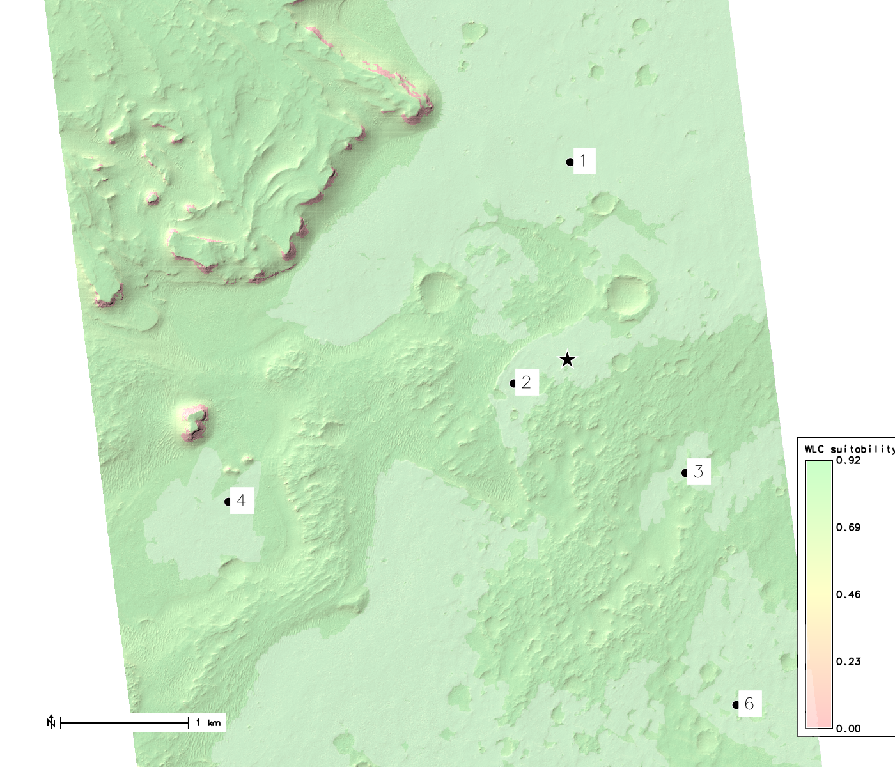

*Candidate polygons filled white at 30 % opacity, labelled by rank. Black star
with white halo: Octavia E. Butler Landing at (4 591 302, 1 093 400) m.
Background: WLC suitability (light-red → yellow → light-green) over hillshade.
Cropped to a 6 km (N–S) × 7 km (E–W) window centred on candidate #2.*

---

### Standard map set: Artemis-III — de Gerlache Rim 2 (Moon, LOLA 5 m)

Eight-panel standard map set for the Artemis-III de Gerlache Rim 2 candidate
region (15×15 km, LOLA 5 m). Row 1: hillshade, hazard composite, integrated
illumination fraction, PSR mask. Row 2: Earth-visibility fraction, Gateway
orbital-relay contact fraction, WLC suitability surface, ranked candidates.
This site dominates the nine-region Artemis cross-ranking: it simultaneously
holds the highest illumination (> 0.95 over the 6.5-day mission window) and
a competitive orbital-contact fraction, contributing six of the top-ten
composite-scored candidates.

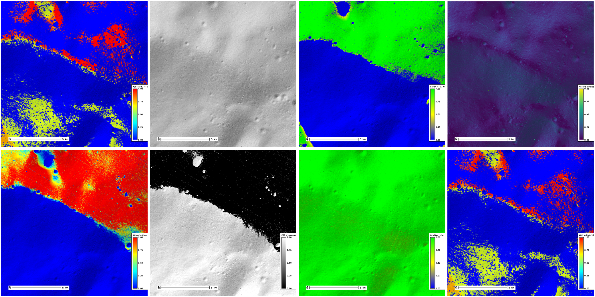

---

### Standard map set: Ceres — Occator Crater (Dawn HAMO 137 m)

Eight-panel standard map set for the Ceres case study at Occator Crater
(Dawn HAMO global DTM, 137 m, 300×300 km AOI). Occator's 92 km-diameter rim
and central depression sit at frame centre; the hazard composite saturates
near unity throughout the crater and its ejecta blanket. The WLC suitability
surface is strongly bimodal; a single canonical candidate emerges ~150 km
NW of Occator on a smooth western plain — the framework correctly places
engineering safety outside the crater, exposing the science-vs-safety tradeoff
any real Ceres lander mission would have to resolve (land safely and traverse
~150 km to the Cerealia Facula brines, or accept a sub-optimal ellipse
inside Occator to reach them directly).

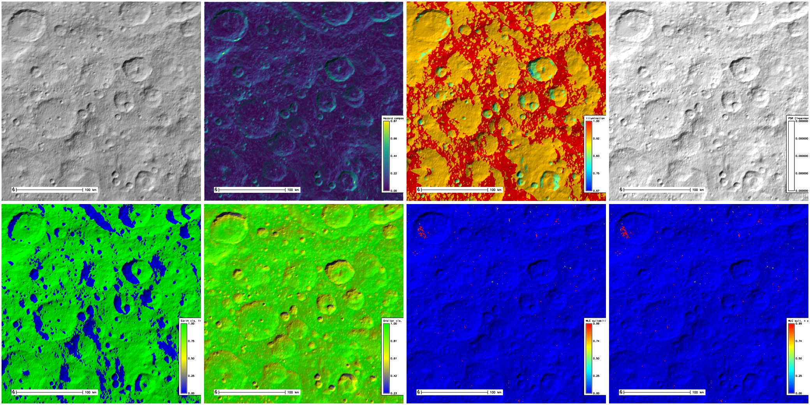

---

### Standard map set: Phobos — Stickney Crater (MEX HRSC 100 m)

Eight-panel standard map set for the MMX-class Phobos analysis at Stickney
Crater (Mars Express HRSC global DEM, 100 m, 244 251 cells covering the
entire body). Stickney dominates the leading hemisphere at left; candidate
clusters surface south and east of its rim. The hazard composite is uniformly
low across most of the surface, consistent with the very loose effective slope
budget at Phobos's 0.0006 g surface gravity. Earth and orbiter visibility are
notably non-uniform: the sub-Mars hemisphere sees Mars blocking ~22 % of the
sky. Ten candidates at very high mean suitability (0.994–0.997) are returned,
with Monte-Carlo rank-1 probability distributed rather than concentrated — at
100 m posting the engineering surface is broadly safe and the decision becomes
science-priority. The same pipeline that handled a 3 396 km Mars at 0.38 g
here handles an 11 km irregular satellite at 0.0006 g; only the descriptors
change.

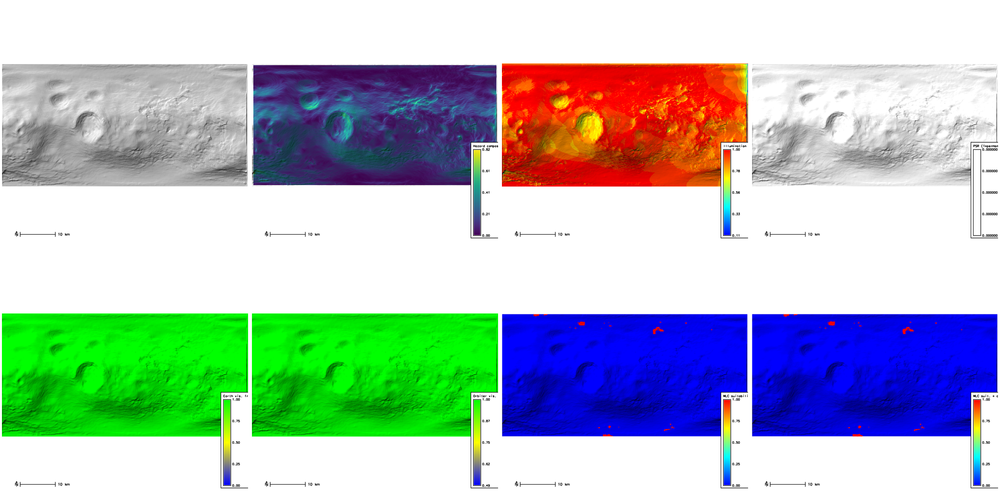

---

## Layout

```
Planetary/
├── planetary/        55 p.*/g.* GRASS addon modules (standard GRASS category subdir)
│   ├── Makefile       category Makefile — MODULE_TOPDIR ?= $(HOME)/dev/grass
│   ├── p_lib.py       shared Python library (landing pipeline utilities)
│   ├── p_spice.py     shared Python library (SPICE kernel management)
│   └── p.*/           one subdir per module, each with its own Makefile
├── libs/             7 fundamental C libraries (p_pds, p_photomodel, ...)
├── bodies/           body descriptor JSON files (Moon, Mars, Venus)
├── missions/         mission JSON files (27 missions incl. Luna 27, Artemis, ...)
├── cspice-pkg/       self-contained build of NAIF CSPICE as planetary-cspice .deb
└── debian/           Debian packaging (grass-planetary-addons .deb)
```

The `planetary/` directory follows the same convention as `grass-addons/src/raster/`,
`grass-addons/src/imagery/`, etc., so Planetary builds and installs alongside
the community addons using the same `MODULE_TOPDIR=$HOME/dev/grass` variable.

`qtgrass` (separate repo: `$HOME/dev/qtgrass`) provides a Qt6 GUI whose
Planetary menu is **auto-constructed from each module's first two keywords**
(`Planetary` → category). Adding a new `p.*` module with the correct keywords
makes it appear in the right submenu automatically.

## Keyword convention

Every module declares its first two keywords as:

1. `Planetary` — marks the module as belonging to this suite
2. Category string — controls the submenu in both the GRASS wxGUI and qtgrass

The category must match one of the strings in the table below exactly.

## Module index, by category

| Category                       | Modules                                                                                      |
|--------------------------------|----------------------------------------------------------------------------------------------|
| **Import & Export**            | `p.in.pds3`, `p.in.pds4`, `p.in.isis`, `p.out.isis`, `p.in.archive`, `p.in.lroc.nac`, `p.in.pds`, `p.in.dem`, `p.in.ancillary` |
| **Camera & Geometry**          | `p.spiceinit`, `p.caminfo`, `p.cam2map`                                                     |
| **SPICE & Ephemeris**          | `p.in.spice`, `p.spice.config`, `p.spice.subpoint`                                          |
| **Photometric Analysis**       | `p.phocube`, `p.photomet`, `p.atcorr.hapke`, `p.photrim`, `p.albedo`                        |
| **Spectral & Mineral Mapping** | `p.spectral.planet`, `p.mineral.indices`, `p.specpix`                                       |
| **Terrain Analysis**           | `p.dem.prep`, `p.slope.planet`, `p.shadow.planet`, `p.terrain.slope`, `p.terrain.roughness`, `p.terrain.hazard`, `p.terrain.ellipse`, `p.horizon.gpu` |
| **Illumination**               | `p.sunmask` (OpenMP + OpenCL), `p.illumination.shadow`, `p.illumination.sunfraction`        |
| **Visibility**                 | `p.visibility.earth`, `p.visibility.los`, `p.visibility.orbiter`                            |
| **Ring Plane Analysis**        | `p.rings.project`, `p.rings.stats`                                                          |
| **Noise & Calibration**        | `p.dstripe`, `p.desmear`, `p.cubenorm`, `p.bandnorm`                                        |
| **Mosaic**                     | `p.automos`                                                                                  |
| **Crater Analysis**            | `p.crater.draw`, `p.crater`, `p.crater.freq`                                                |
| **Decision Support**           | `p.mcdm.weight`, `p.mcdm.score`, `p.rank`, `p.rank.cross`                                  |
| **Landing Pipeline**           | `p.landing`, `g.gui.landing` (wxPython wizard), `p.landing.qt` (Qt6, standalone)            |
| **Utilities**                  | `p.target.info`                                                                              |

## Libraries

### C libraries (`libs/`)

Shared C libraries in `libs/`, each with its own `README.md`:

- `p_pds` — PDS3/PDS4 label parsing + image I/O
- `p_photomodel` — 7 photometric models (Lambert, Minnaert, Hapke H/L, Lunar-Lambert, LL-McEwen)
- `p_atmosmodel` — 4 atmospheric radiative-transfer models (Chandrasekhar H-function)
- `p_shapemodel` — ellipsoid, DEM, plane ray-surface intersection
- `p_projection_planet` — ring-cylindrical, lunar azimuthal equal-area, upturned-TA projections
- `p_spectra` — band depth, continuum removal, SAM, high-pass / division filters
- `p_spice` — NAIF CSPICE geometry-toolkit wrapper

`p.sunmask` additionally builds `libpsunmask.so` (installed to
`/usr/lib/x86_64-linux-gnu/`), a pure C + OpenMP/OpenCL shared library used
by `p.illumination.sunfraction` for in-RAM, per-timestep shadow casting.

### Python libraries (`planetary/`)

- `p_lib.py` — 880-line core: DEM processing, sun-position calculations,
  body/mission JSON loading, AHP logic, illumination and visibility helpers.
- `p_spice.py` — 270-line SPICE wrapper: kernel download, per-mapset
  configuration, sub-solar and sub-Earth point computation.

Both live at the root of `planetary/`. After deb install they land at
`/usr/lib/grass/addons/p_lib.py` and `/usr/lib/grass/addons/p_spice.py`,
so `dirname(dirname(abspath(__file__)))` from any script in
`addons/scripts/p.*` resolves to `addons/` correctly.

## Data

- `bodies/` — physical constants for Moon, Mars, and Venus (radius, gravity,
  axial tilt, nutation period, sidereal day) in JSON format.
- `missions/` — 27 mission JSON files: Apollo 11/15/17, Artemis, Chandrayaan-3,
  Chang'e 4/6, Curiosity, IM-1 Odysseus, InSight, Luna 9/17/27, Opportunity,
  Pathfinder, Perseverance, Phoenix, SLIM, Spirit, Vega 2, Venera 13/14,
  Viking 1/2, Zhurong. Pass the path via `p.landing mission=`.

## Build & install

### Option A — Debian packages (recommended)

Always start with a clean slate to avoid GRASS version hash mismatches:

```bash
cd ~/dev/Planetary
make clean && make deb
```

`make deb` stamps a datetime suffix onto the version (`1.0.0+YYYYMMDDHHMMSS`),
so every rebuild produces a strictly higher version and `dpkg -i` always
overwrites installed files without manual removal.

Install in dependency order (`Pre-Depends` enforces it automatically):

```bash
cd ~/dev
sudo dpkg -i planetary-cspice_1.0.0+<timestamp>_amd64.deb
sudo dpkg -i grass-planetary-addons_1.0.0+<timestamp>_amd64.deb
```

### Option B — Direct build alongside GRASS and grass-addons

```bash
make MODULE_TOPDIR=$HOME/dev/grass clean
make MODULE_TOPDIR=$HOME/dev/grass -j8
cd $HOME/dev/grass && sudo make install
cd $HOME/dev/Planetary
sudo make MODULE_TOPDIR=$HOME/dev/grass INST_DIR=/usr/local/grass86 install
```

The full workflow (GRASS core → community addons → Planetary → system install)
is captured in `$HOME/dev/update.sh`.

Build-time OpenCL is auto-detected in three modules:
- `p.crater.draw` — DEM/image detector inner loops.
- `p.sunmask` — shadow-casting kernel; also builds `libpsunmask.so`.
- `p.horizon.gpu` — horizon-elevation raster; falls back to OpenMP-only.

## ISIS3 compatibility

| ISIS3 application | GRASS equivalent     | Notes |
|-------------------|-----------------------|-------|
| `isis2std`        | `p.in.isis`           | reads `.cub` files |
| `std2isis`        | `p.out.isis`          | writes back to `.cub` |
| `spiceinit`       | `p.spiceinit`         | NAIF kernel paths in raster metadata |
| `caminfo`         | `p.caminfo`           | sub-solar, sub-spacecraft, lat/lon |
| `cam2map`         | `p.cam2map`           | sensor → 8 standard map projections |
| `phocube`         | `p.phocube`           | incidence/emission/phase/lat/lon backplanes |
| `photomet`        | `p.photomet`          | 7 photometric models, normalisation |
| `photrim`         | `p.photrim`           | mask by i/e/g angles |
| `cubenorm`        | `p.cubenorm`          | per-line/per-sample normalisation |
| `bandnorm`        | `p.bandnorm`          | multi-band normalisation to reference band |
| `dstripe`         | `p.dstripe`           | column/row median destriping |
| `desmear`         | `p.desmear`           | TDI/push-broom smear correction |
| `specpix`         | `p.specpix`           | NULL/LRS/LIS/HIS/HRS classification |
| `shadow`          | `p.shadow.planet`     | ray-marching shadow mask |
| `ringscam2map`    | `p.rings.project`     | ring-plane projection |
| `automos`         | `p.automos`           | multi-image mosaic with feathering |

## Testsuites

```bash
# Run a single module's tests inside a GRASS XY location
grass /tmp/grass_test/PERMANENT --exec \
    python3 -m unittest -v test_pcrater
```

| Module          | Tests | Pass  |
|-----------------|-------|-------|
| `p.crater`      | 11    | 11/11 |
| `p.crater.draw` | 11    | 11/11 |
| others          | ≥ 1   | all   |

## Versioning convention

Patch numbers stay single-digit: at the rollover from `0.x.9` we bump
the minor: `0.5.9 → 0.6.0`. This keeps changelog headers visually clean
and avoids lexicographic-sort foot-guns.

## License

The Unlicense (https://unlicense.org) — every module and library is
released into the public domain. See per-directory `LICENSE` files and
`debian/copyright`.

## Author

Yann Chemin — dr.yann.chemin@gmail.com
